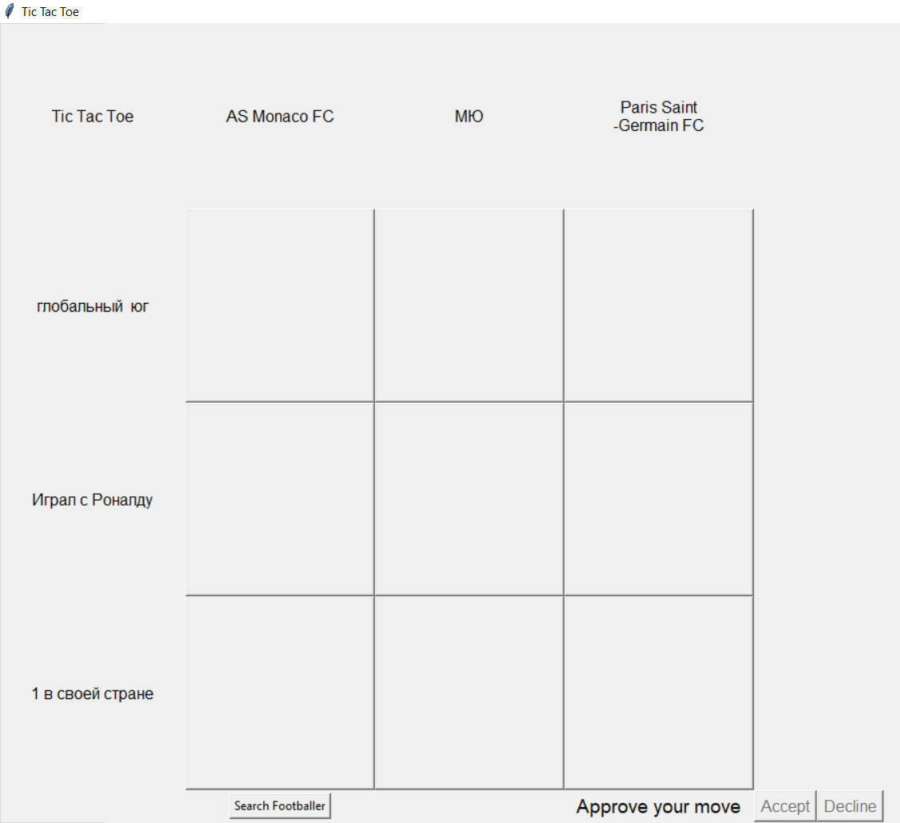

# [Tic-Tac-Toe - Football Edition](https://github.com/kozgunov/TicTacToe/blob/main/TicTacToe_2/tic-tac-toe_2v2.py)

## Introduction

Welcome to Tic-Tac-Toe - Football Edition, a unique twist on the classic Tic-Tac-Toe game where players not only play to win but also engage with football trivia. This game adds an exciting layer of interactivity by incorporating football clubs, countries, and features randomly, and players must guess the footballer that fits the given criteria.

## Features

- **3x3 Grid**: An extended grid for more strategic gameplay.
- **Approve Moves**: Players can propose a move and either accept or decline it.
- **Animations**: Fun different animations to celebrate wins, losses, and draws.
- **Search Functionality**: Search for footballers directly from the game and view their details from various online sources.
- **Timer**: Add a timer to enhance the challenge.(it's under comments)
- **Full-Screen Mode**: Immersive full-screen gameplay experience.
- **Interactive GUI**: Built with Tkinter for a smooth and responsive user interface.

## Installation

1. **Clone the Repository**:
    ```sh
    git clone https://github.com/kozgunov/TicTacToe.git
    cd TicTacToe/TicTacToe_2
    ```

2. **Install the Required Dependencies**:
    Make sure you have Python installed. Then, install the required libraries using pip:
    ```sh
    pip install pandas openpyxl tkinter webbrowser
    ```

## Usage

1. **Run the Game**:
    ```sh
    python tic-tac-toe_2v2.py
    ```

2. **Game Instructions**:
    - **Starting the Game**: The game will start in full-screen mode. Press `Escape` to exit full-screen.
    - **Making Moves**: Click on the grid to propose a move. Use the "Accept" and "Decline" buttons to confirm or reject the move from the referee side.
    - **Searching for Footballers**: Click the "Search Footballer" button and enter the footballer's name to search for their details online.
    - **Using the Timer**: Set the desired duration in minutes in the timer input field, then use the "Start", "Stop", and "Reset" buttons to control the timer.

## Components

- **TicTacToeApp Class**: The main class that handles the game logic and GUI.
- **Search Functionality**: Integrated with web browser searches to display footballer information.
- **Animations**: Visual feedback for game outcomes.
- **Timer**: A countdown timer that adds pressure to the gameplay.

## Example
       


## Contributing

We welcome contributions! Please fork the repository and submit pull requests.

## License

No license is here. I'd glad to see your stars under the project) 

## Contact

For any inquiries or feedback, feel free to contact us at [Nikita](kozgunovn@mail.ru).

---

**Enjoy the game and may the best footballer win!**

